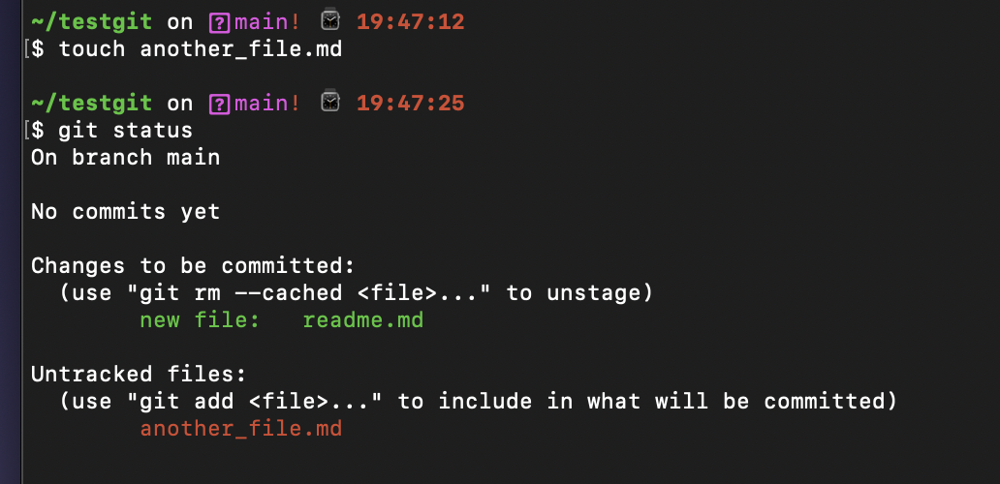
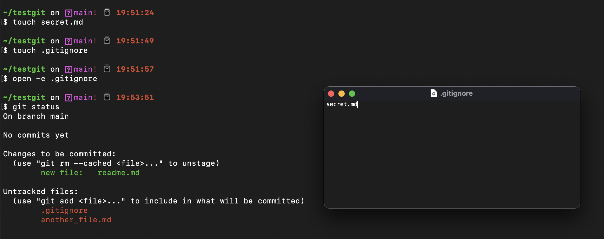

```{r setup, include=FALSE}
knitr::opts_chunk$set(echo = FALSE)
```

## What's it for?

 - `.gitignore` marks the items that you do not want to track in your repository
 - ignored files will never show up as modified or committed to your repository
 
 ```{r, echo=FALSE, out.width="70%"}
   
```

## Really, not tracked at all?

 ```{r, echo=FALSE, out.width="80%"}
   
```


## Where it goes wrong

- You forget to ignore your giant data directory
- You forget to ignore your ugly intermediate files
- **You forget to ignore your very sensitive information**

## A few approaches

 - Amend the commit!
 - Delete the file in all repositories
 - Remove the file from repo but keep
 - Drastic rewrite

.. after any of these, add the file or dir to your .gitignore for future 
 
## Amend the commit!


 - Remove the info from your local copy 
 - `git commit -a --amend`  (if last commit)
 - `git rebase -i origin/master` (if previous unpushed commit)
 
 - **only works if you catch BEFORE pushing**
 
## Delete the file in all repositories (all branches)

 - Delete it at github or gitlab through the GUI
 - Delete the file in your local repository 
 - If you need the file, copy it somewhere else first
 - Add file to .gitignore
 
 - **works great for immediate fix or for a repo that is not used by many**
 - **file will still exist in other clones or forks**

## Remove file from git repository but keep on your computer

 - This removes the file (rm) but keeps it locally (cached)
```
git rm --cached file.txt
git commit -m "remove file.txt"
git push
```
 - Add file to .gitignore
 
 - **works great for immediate fix or for a repo that is not used by many**
 - **file will still exist in other clones or forks**
 - **file will still exist in earlier commits**
 
## Drastic rewrite

  - OPTIONS:
    - `git filter-branch`
    - `git forget-blob`
    

 - Add file to .gitignore
 - Change all passwords and keys
 
 - **for sensitive info**
 - **makes changes to every commit in history**

## References

 - Git book https://git-scm.com/book/en/v2
 
 - Github learning page https://docs.github.com/en/get-started/quickstart/git-and-github-learning-resources
 
  - Details from Github for sensitive information https://docs.github.com/en/authentication/keeping-your-account-and-data-secure/removing-sensitive-data-from-a-repository
